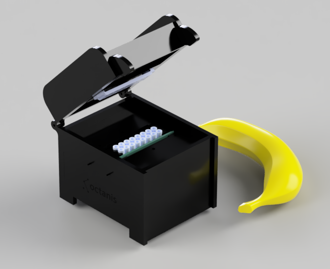

# Octanis qPCR

Quantitative PCR or sometimes called real-time PCR is a method to amplify a target DNA molecule and monitor its replication via fluorescence. The objective of this Octanis qPCR is to build a reliable and open qPCR machine for research purposes.

## COVID-19 and PCR

COVID-19 testing involves qPCR machines where an additional step needs to be completed prior to amplification. Using an enzyme called [Reverse Transcriptase](https://en.wikipedia.org/wiki/Reverse_transcriptase) the viral RNA is turned into DNA that the [Polymerase](https://en.wikipedia.org/wiki/Polymerase) can work with. 

## Current state

We are currently working on assembling the first PCBs and writing firmware. As we finalize the first prototype we will be updating this repository with our work in progress. 

If you are interested in contributing to the project [DM us](https://twitter.com/octanisorg). there are lots of cool sub-projects:
- STM32 firmware development
- SPICE simulation
- Case design
- Device GUI development

On our task list:
- Publication of an eBOM and mBOM.
- Collaboration with somebody making PCR tests/master mixes.

Completed:
- [Lid Heater PCB](https://pcb.im/share/dadb9a33574c403e)
- [16 Channel Excitation PCB](https://pcb.im/share/144b98556b9944f6)
- [8 Channel Emmision Sensing PCB](https://pcb.im/share/420ee10b3fee4fb8)
- [mainboard PCB](http://pcb.im/share/4b724f7b39da497d)

## Acknowledgements
- Chaibio, for the block and lid heater design, which we slightly modified.

## Sponsors
- [Octanis Instruments GmbH](https://www.octanis.ch) is helping with engineering and manufacturing.

## Similar projects
- [Chai Open qPCR](https://www.chaibio.com/openqpcr)
- [Ninja PCR](https://hackaday.io/project/174501-covid-19-detectors-300-real-time-pcr-50-lamp)
